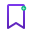
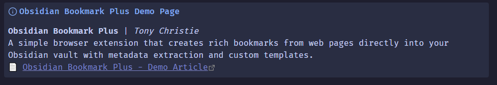
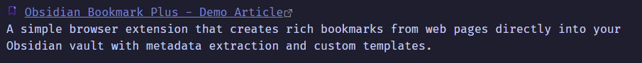
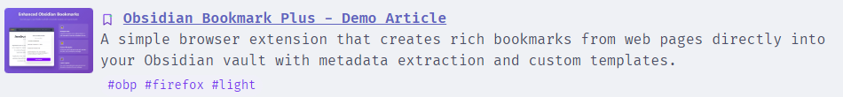
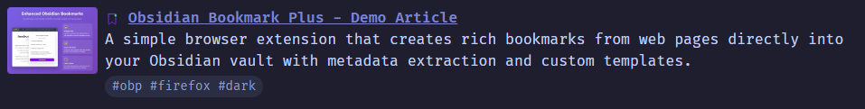
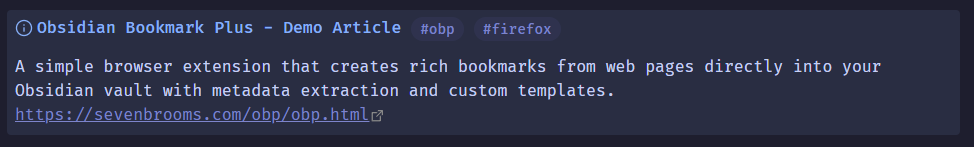

#  Obsidian Bookmark Plus
#### Enhanced browser extension that creates rich bookmarks from any webpage directly into your Obsidian vault.

**Cross-browser support:** Firefox, Chrome, Edge, and other Chromium-based browsers.

## 📖 How to use 

### Prerequisites
1. Install the [**Obsidian Advanced URI**](https://github.com/Vinzent03/obsidian-advanced-uri) plugin in Obsidian

### Installation
2. Install the extension:
   - **Firefox**: [Firefox Add-ons Store](https://addons.mozilla.org/firefox/addon/obsidian-bookmark-plus/)
   - **Chrome/Edge**: [Chrome Web Store](https://chrome.google.com/webstore/detail/obsidian-bookmark-plus)

### Setup
3. Click the extension icon and select "Options" (or go to browser extensions page)
4. Configure your settings:
   - **Vault name**: Your Obsidian vault name (e.g., "Obsidian Vault")
   - **Document Paths**: One path per line, first path is default. Bookmarks are appended to these files (created if they don't exist)
     ```
     Bookmarks
     Research/Articles
     Projects/Web Clippings
     ```
   - **Template**: Customize how bookmarks appear (see examples below)

⚠️ **Template Warning**: Templates support raw HTML and are inserted directly into your Obsidian notes. Only use templates from trusted sources and avoid complex HTML if you're not familiar with it.

### Usage
5. Navigate to any webpage you want to bookmark
6. Click the Obsidian Bookmark Plus icon in your address bar
7. Adjust title, tags, or description if needed
8. Select document path and click "Add Bookmark"

## 🏷️ Template Variables

### Basic Variables
- `{title}` - Page title
- `{url}` - Page URL  
- `{description}` - Meta description
- `{tags}` - Your custom tags
- `{keywords}` - Meta keywords
- `{author}` - Page author
- `{canonical}` - Canonical URL

### Open Graph Variables (with fallbacks)
- `{og:title}` - Social media title (fallback: `{title}`)
- `{og:description}` - Social media description (fallback: `{description}`)
- `{og:image}` - Featured image URL
- `{og:site_name}` - Website/publication name
- `{og:type}` - Content type (article, website, etc.)

### Visual Elements
- `{favicon}` - Site favicon URL

## 📋 Template Examples

### Simple Text Bookmark
```
[{title}]({url}) - {description}
```

### Rich Article Bookmark

```
> [!info] {og:title}
> **{og:site_name}** | *{author}*
> {og:description}
> 📄 [{title}]({url})
```

### Visual Bookmark with Favicon

```
 [{title}]({url})
{description}
```

### Rich Visual Layout (Light Theme)

```html

<div style="display: flex; align-items: flex-start; gap: 8px;">
  
  <div>
     
    <strong><a href="{url}">{title}</a></strong><br>
    {description}<br>
    <span style="display: inline-block; background: #f0f0f8; color: #7c3aed; padding: 2px 8px; border-radius: 12px; font-size: 0.85em; margin-top: 4px;">{tags}</span>
  </div>
</div>

```

### Rich Visual Layout (Dark Theme)

```html

<div style="display: flex; align-items: flex-start; gap: 8px;">
  
  <div>
     
    <strong><a href="{url}">{title}</a></strong><br>
    {description}<br>
    <span style="display: inline-block; background: #2b2d42; color: #8b9dc3; padding: 2px 8px; border-radius: 12px; font-size: 0.85em; margin-top: 4px;">{tags}</span>
  </div>
</div>

```

### Notion-Style Import

```
> [!info] {title} {tags}
> {description}
> {url}
```

### Research Format
```
## {og:title}
**Source**: {og:site_name}  
**Author**: {author}  
**Type**: {og:type}  
**URL**: {canonical}

{og:description}

**Keywords**: {keywords}
```

## 🛠️ Build from Source

### Requirements
- Bash shell
- Node.js (for `npx web-ext`)

### Building
```bash
# Clone repository
git clone https://github.com/christiet/obsidian-bookmark-plus.git
cd obsidian-bookmark-plus

# Make build script executable
chmod +x build.sh

# Build for both browsers (default)
./build.sh

# Or build for specific browser
./build.sh firefox
./build.sh chrome

# Clean build artifacts
./build.sh clean
```

Built extensions will be in `dist/firefox/` and `dist/chrome/` directories.

## 🐛 Troubleshooting

### No bookmark created
1. **Check Obsidian Advanced URI**: Ensure the plugin is installed and enabled
2. **Allow external links**: Obsidian may ask permission to open links from browser
3. **Verify paths**: Document paths must exist in your vault before use
4. **Check vault name**: Must match exactly (case-sensitive)

### Missing metadata
- Some sites don't provide all metadata types
- MediaWiki sites (Wikipedia, etc.) use non-standard meta tags
- Metadata extraction works best on modern news sites, blogs, and e-commerce

### Template not working
- Check template syntax carefully
- Use `\n` for line breaks in templates
- Test with default template first, then customize

## 💻 Credits

- [Obsidian Advanced URI](https://github.com/Vinzent03/obsidian-advanced-uri) - Essential companion plugin
- [Patrik Žúdel](https://github.com/patrikzudel/firefox-obsidian-bookmark) - Original inspiration
- [PhosphorIcons](https://phosphoricons.com/) - Icon design

---

🚀 **Enhanced by [Tony Christie](https://github.com/christiet)**